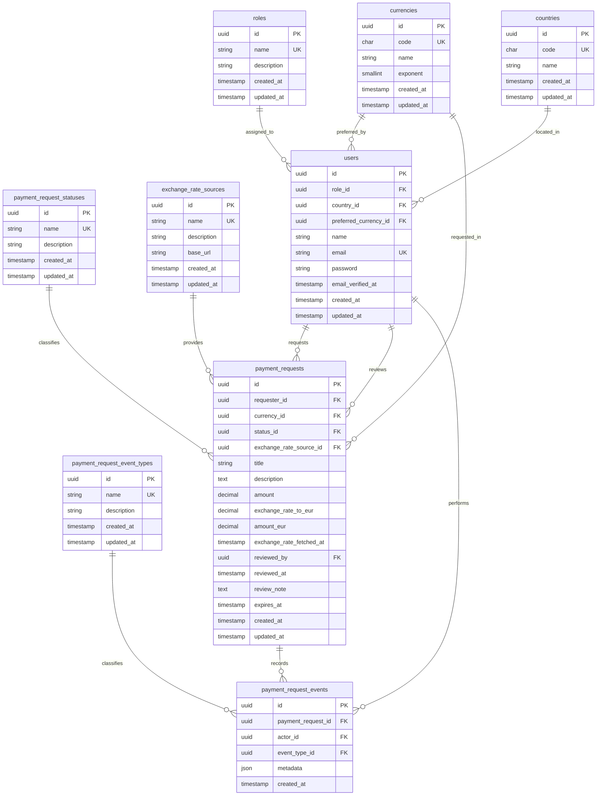

# Database Diagram

This document records the initial database design direction before adding user roles and seed data.

## Current Decision

Roles, countries, currencies, exchange rate sources, payment request statuses, and payment request event types are stored in dedicated lookup tables.

Each user belongs to exactly one role through `users.role_id`, one country through `users.country_id`, and one preferred currency through `users.preferred_currency_id`.

This keeps repeated fixed values normalized without introducing many-to-many complexity before the project needs it.

## Notes

- `roles.name` starts with `employee` and `finance`.
- `countries.code` stores ISO 3166-1 alpha-2 country codes.
- `currencies.code` stores ISO 4217 currency codes.
- `currencies.exponent` stores the number of decimal places normally used by the currency.
- `payment_request_statuses.name` starts with `pending`, `approved`, `rejected`, and `expired`.
- `payment_request_event_types.name` starts with `created`, `approved`, `rejected`, and `expired`.
- `exchange_rate_sources.name` starts with the selected external provider, such as `ExchangeRate-API`.
- `payment_requests.exchange_rate_to_eur`, `amount_eur`, `exchange_rate_source_id`, and `exchange_rate_fetched_at` must be immutable after creation.
- `payment_request_events` provides basic audit history for create, approve, reject, and expire actions.

Only `roles`, `countries`, `currencies`, and the additional user relationships are part of the current delivery. Payment request, exchange rate source, status, and event type tables are documented here to validate the model direction before later migrations.
